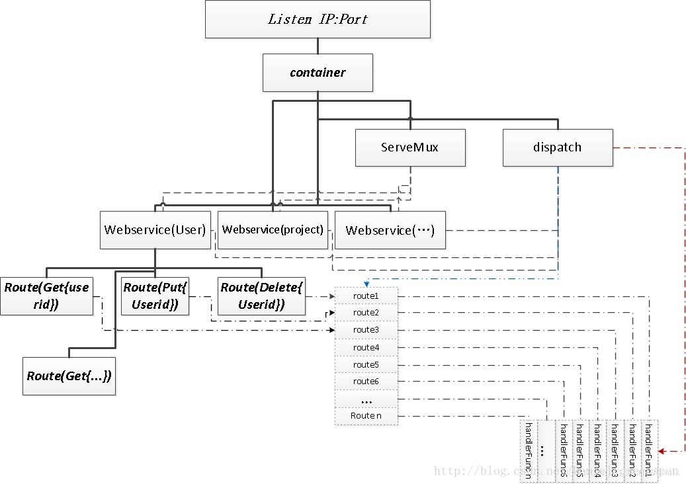

# go-restful

[go-restful](https://github.com/emicklei/go-restful)，基于 Go 语言实现的 Restful 服务接口。

## 核心概念

### Container

表示一个 Web Server（服务器），由多个 WebServices 组成，此外还包含了若干个 Filters（过滤器）、一个 http.ServeMux 多路复用器以及一个 dispatch。go-restful 如何在从 Container 开始将路由分发给各个 WebService，再由 WebService 分发给具体的 Handler 函数，这些都在 dispatch 中实现。

### WebService

一个 WebService 由若干个 Routes 组成，并且 WebService 内的 Routes 拥有同一个 RootPath、输入输出格式、基本一致的请求数据类型等等一系列的通用属性。通常的，我们会根据需要将一组相关性非常强的 API 封装成为一个 WebServiice，继而将 Web Application 所拥有的全部 APIs 划分若干个 Group。

所以，WebService 至少会有一个 Root Path，通过 ws.Path() 方法设置，例如：/user_group，作为 Group 的 “根”。Group 下属的 APIs 都是 RootRoute（RootPath）下属的 SubRoute（SubPath）。

每个 Group 就是提供一项服务的 API 集合，每个 Group 会维护一个 Version。Group 的抽象是为了能够安全隔离的对各项服务进行敏捷迭代，当我们对一项服务进行升级时，只需要通过对特定版本号的更新来升级相关的 APIs，而不会影响到整个 Web Server。视实际情况而定，可能是若干个 APIs 分为一个 Group，也有可能一个 API 就是一个 Group。

### Route

Route 表示一条请求路由记录，即：Resource 的 URL Path（URI），从编程的角度可细分为 RootPath 和 SubPath。Route 包含了 Resource 的 URL Path、HTTP Method、Handler 三者之间的组合映射关系。go-restful 内置的 RouteSelector（请求路由分发器）根据 Route 将客户端发出的 HTTP 请求路由到相应的 Handler 进行处理。

go-restful 支持两种路由分发器：快速路由 CurlyRouter 和 RouterJSR311。实际上，CurlyRoute 也是基于 RouterJSR311 的，相比 RouterJSR11，还支持了正则表达式和动态参数，也更加轻量级，Kubernetes ApiServer 中使用的就是这种路由。

CurlyRouter 的元素包括：请求路径（URL Path），请求参数（Parameter），输入、输出类型（Writes、Reads Model），处理函数（Handler），响应内容类型（Accept）等。

参考文章：

[golang go-restful RESTful框架 简介](https://blog.csdn.net/whatday/article/details/109278845)
